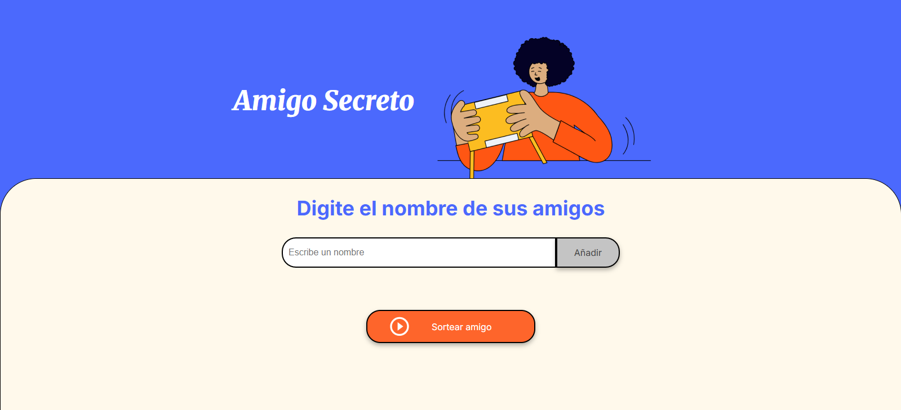
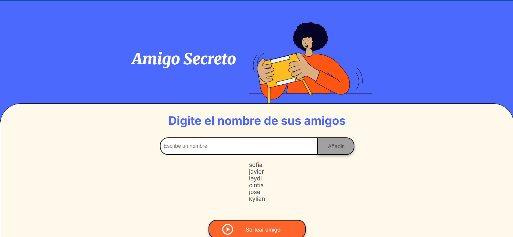
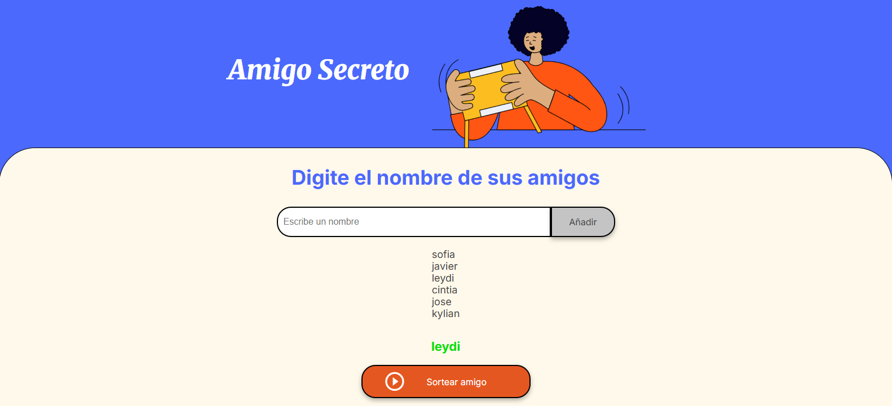

# 🎁 AMIGO SECRETO

Una aplicación web simple para crear sorteos de amigo secreto de manera interactiva.

---

## ✨ Descripción

Este proyecto nos permite:

- Añadadir nombres de amigos a una lista.
- Visualizar la lista de nombres agregados.
- Realiza un sorteo aleatorio.
- Eviten que se repitan los nombres que ya salieron.
- Muestra un mensaje cuando ya no queden mas nombres por salir.

Está desarrollado con **HTML**, **CSS** y **JavaScript**
---

## 🚀 Funcionalidades

✅ **Agregar nombres:** Permite escribir un nombre en el campo de texto y lo añade a la lista haciendo clic en **Añadir**.  
✅ **Visualizar la lista:** Cada nombre agregado aparece inmediatamente en la parte de abajo.  
✅ **Sorteo aleatorio:** Al pulsar **Sortear amigo**, se elige un nombre al azar que no haya salido antes.  
✅ **No repetir nombres:** Una vez sorteado un nombre, se elimina de la lista de opciones.  
✅ **Mensaje de finalización:** Cuando ya se han sorteado todos los nombres, se muestra el mensaje:

> _Se han sorteado todos los nombres agregados_

---

## 📷 Capturas de pantalla

muestra de como sale la aplicacion en uso:

### Pantalla principal

### Lista con nombres agregados

### Sorteo realizado

---

## 🛠 Tecnologías utilizadas

- HTML5
- CSS
- JavaScript

---

## 📂 Estructura del proyecto

amigo-secreto/
│
├── assets/ # Imágenes de la aplicación
├── screenshots/ # Capturas de pantalla de que el proyecto funciona
│ ├── pantalla-principal.png
│ ├── nombres-agregados.png
│ └── sorteo-realizado.png
├── index.html # Página principal
├── style.css # Estilos del proyecto
├── app.js # Lógica en JavaScript
└── README.md # Documentación del proyecto

---

✍️ **Autor:** *Leydi Chavez*